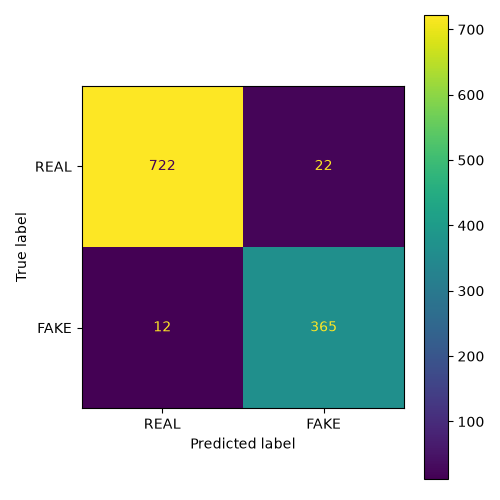

# Counterfeit Indian Currency Detection using MobileNetV3

A deep learning-based image classification system for detecting counterfeit Indian currency notes using **Transfer Learning** with **MobileNetV3-Large**.

The model is trained to classify an input image of an Indian currency note into one of two categories:

- **REAL**
- **FAKE**

The project includes the complete machine learning pipeline starting from dataset preparation and preprocessing to model training, evaluation, and inference.

---

# Features

- Binary classification (REAL vs FAKE)
- MobileNetV3-Large with ImageNet pretrained weights
- Transfer Learning
- PyTorch implementation
- Data augmentation pipeline
- Weighted sampling for class imbalance
- Early stopping
- Model checkpointing
- Mixed Precision Training (AMP)
- Gradient clipping
- Learning rate scheduling
- Evaluation metrics
- Inference script
- Ready-to-use trained model (`best_model.pth`)

---

# Repository Structure

```
currency_ml/

│
├── data/
│
├── models/
│   ├── best_model.pth
│   ├── confusion_matrix.png
│   ├── classification_report.txt
│   ├── test_metrics.json
│   └── training_history.csv
│
├── reports/
│
├── scripts/
│   ├── dataset_audit.py
│   └── split_dataset.py
│
├── src/
│   ├── checkpoint.py
│   ├── dataloader.py
│   ├── dataset.py
│   ├── evaluator.py
│   ├── inference_engine.py
│   ├── metrics.py
│   ├── model.py
│   ├── trainer.py
│   ├── transforms.py
│   └── utils.py
│
├── config.py
├── evaluate.py
├── inference.py
├── train.py
├── requirements.txt
└── README.md
```

---

# Dataset

The project uses a dataset consisting of **real and counterfeit Indian currency notes**.

Directory structure:

```
data/

real/
    10/
    20/
    50/
    100/
    200/
    500/
    2000/

fake/
    10/
    20/
    50/
    100/
    200/
    500/
    2000/
```

Although the images are organized denomination-wise, the prediction task is **binary classification**.

Output classes:

```
REAL
FAKE
```

---

# Dataset Preparation

Before training, the dataset undergoes several preprocessing steps.

### Dataset verification

- Folder validation
- Image counting
- Corrupted image detection
- Duplicate image detection
- Image format verification

### Dataset split

The dataset is divided into:

- Training : 70%
- Validation : 15%
- Testing : 15%

---

# Data Augmentation

The training images are augmented using realistic transformations to improve model robustness.

The augmentation pipeline includes:

- Random Resized Crop
- Random Rotation
- Random Affine Transformation
- Random Perspective Transformation
- Color Jitter
- Gaussian Blur
- Random Erasing

Validation and testing images are **not augmented**.

---

# Image Preprocessing

All images are:

- Converted to RGB
- Resized to **224 × 224**
- Normalized using ImageNet statistics

```
Mean

[0.485, 0.456, 0.406]

Std

[0.229, 0.224, 0.225]
```

---

# Model Architecture

The project uses **MobileNetV3-Large** pretrained on ImageNet.

Transfer learning is applied by replacing the original ImageNet classifier with a custom binary classifier.

Architecture:

```
Input Image
      │
      ▼
MobileNetV3-Large Backbone
      │
      ▼
Custom Classifier

Linear
↓
BatchNorm
↓
Hardswish
↓
Dropout
↓
Linear
↓
BatchNorm
↓
Hardswish
↓
Dropout
↓
Linear
↓
REAL / FAKE
```

---

# Training Configuration

Loss Function

- CrossEntropyLoss

Optimizer

- AdamW

Learning Rate Scheduler

- CosineAnnealingLR

Regularization

- Weight Decay
- Dropout

Training Features

- Mixed Precision Training (AMP)
- Gradient Clipping
- Early Stopping
- Best Model Checkpointing

---

# Model Performance

### Validation Performance

Best Validation F1 Score

```
97.75%
```

### Test Performance

| Metric | Score |
|---------|-------|
| Accuracy | **96.97%** |
| Precision | **94.32%** |
| Recall | **96.82%** |
| F1 Score | **95.55%** |
| ROC-AUC | **99.59%** |

---

# Confusion Matrix

The confusion matrix generated on the held-out test dataset is shown below.

<p align="center">

</p>

---

# Training Pipeline

```
Dataset
        │
        ▼
Dataset Audit
        │
        ▼
Dataset Split
        │
        ▼
Data Augmentation
        │
        ▼
PyTorch Dataset
        │
        ▼
DataLoader
        │
        ▼
MobileNetV3-Large
        │
        ▼
Transfer Learning
        │
        ▼
Training
        │
        ▼
Validation
        │
        ▼
Best Model Checkpoint
        │
        ▼
best_model.pth
```

---

# Installation

Clone the repository

```bash
git clone https://github.com/<your-username>/currency_ml.git

cd currency_ml
```

Create a virtual environment

```bash
python -m venv .venv
```

Activate the environment

Linux/macOS

```bash
source .venv/bin/activate
```

Windows

```bash
.venv\Scripts\activate
```

Install dependencies

```bash
pip install -r requirements.txt
```

---

# Training

Run

```bash
python train.py
```

The best performing model is automatically saved as

```
models/best_model.pth
```

---

# Evaluation

Run

```bash
python evaluate.py
```

Outputs generated:

```
classification_report.txt

test_metrics.json

confusion_matrix.png
```

---

# Inference

Predict a single image

```bash
python inference.py --image path/to/image.jpg
```

Example output

```
Prediction : REAL

Confidence : 0.9982
```

JSON output

```bash
python inference.py --image path/to/image.jpg --json
```

Example

```json
{
    "prediction": "FAKE",
    "confidence": 0.9871,
    "probabilities": {
        "REAL": 0.0129,
        "FAKE": 0.9871
    }
}
```

---

# Model Specifications

| Property | Value |
|-----------|-------|
| Architecture | MobileNetV3-Large |
| Framework | PyTorch |
| Input Size | 224 × 224 |
| Classes | REAL, FAKE |
| Transfer Learning | Yes |
| Pretrained Weights | ImageNet |
| Model Size | ~14 MB |

---

# Technologies Used

- Python
- PyTorch
- Torchvision
- NumPy
- Pillow
- OpenCV
- Scikit-learn
- Matplotlib
- tqdm

---

# Future Improvements

Potential extensions to this project include:

- ONNX model export
- INT8 quantization for faster CPU inference
- Grad-CAM visualizations
- Multi-task learning (counterfeit detection + denomination recognition)
- Real-time webcam inference
- Mobile deployment

---

# License

This project is intended for educational and research purposes.

Please ensure that any dataset used complies with its respective licensing terms.

---

# Author

**Sai Shiva**

B.Tech Computer Science Engineering

Artificial Intelligence | Machine Learning | Computer Vision | FinTech
